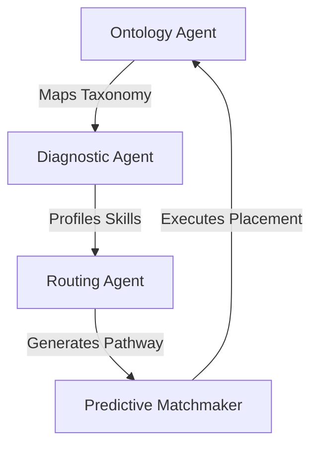

# AXIS Talent Intelligence Ecosystem

## Vision

AXIS (Academic eXcellence & Industry Synergy) is an AI-powered Talent Intelligence Ecosystem designed to solve the growing disconnect between education, workforce development, and employment.

Traditional learning management systems focus on delivering training. Traditional HR systems focus on tracking employees. AXIS bridges both worlds by creating a continuous intelligence loop that aligns academic outcomes, workforce skills, learning interventions, and talent deployment.

The goal is to transform workforce development from a reactive process into a predictive and continuously optimized ecosystem.

---

# Problem Statement

The future workforce faces significant disruption due to:

* Artificial Intelligence
* Automation
* Digital Transformation
* Climate-related economic shifts
* Geoeconomic fragmentation

Organizations increasingly struggle to identify, develop, and deploy talent quickly enough to meet evolving business needs.

Key challenges include:

## Workforce Skill Instability

A large percentage of workers require reskilling and redeployment.

Organizations face:

* Persistent skills gaps
* Long onboarding cycles
* Inefficient retraining programs
* Difficulty identifying deployment-ready talent

## Academia-Industry Misalignment

Educational institutions and employers often use different frameworks to describe skills and competencies.

This creates:

* Hiring inefficiencies
* Redundant training costs
* Longer time-to-productivity
* Poor workforce planning

## Static Learning Systems

Most learning systems provide generic training content rather than personalized development pathways.

This results in:

* Low engagement
* Slow skill acquisition
* Poor learning ROI
* Limited internal mobility

---

# Core Concept

AXIS creates a shared skills intelligence layer between education and industry.

The platform continuously:

1. Understands workforce requirements
2. Assesses skills
3. Identifies gaps
4. Recommends development actions
5. Validates competency
6. Matches talent to opportunities
7. Learns from outcomes

This creates a self-improving ecosystem.

---

# Primary Stakeholders & Portals

The AXIS platform is organized into three distinct user portals representing separate system domains powered by the same backend state engine:

## 1. Talent Portal Domain
**Target Persona:** Students, Learners, and Upskilling Employees.
*   **Active User Simulation:** Signed in as *Gerard Cruz - BS Computer Science, Senior*.
*   **Key Capabilities:**
    *   *Skill Passport View*: Renders progress across four primary validation categories (Technical, Data, Business, and Soft).
    *   *Competency Target Radar Map*: Shows a spider chart layout comparing the user's current proficiencies vs. target role (e.g., Data Engineer) requirements.
    *   *Learning Pathway Kanban*: Displays a 4-week learning path generated by the Routing Agent, with automated bypassing of satisfied modules (e.g., Python Core).
    *   *Recent Activity Logging*: Visualizes historical assessment scoring and custom sprint scheduling events.

---

## 2. L&D Corporate Portal Domain
**Target Persona:** Corporate HR Leaders, L&D Directors, and Workforce Planners.
*   **Active User Simulation:** Signed in as *Gerard Mendoza - L&D Program Lead*.
*   **Key Capabilities:**
    *   *Active Workforce Pipeline*: Monitors candidate lifecycle states (Assessing, Targeting, Training, Ready, Redeployed).
    *   *Active Corporate Slot Demand*: Outlines opening vacancies (e.g., Globe, BPI, Ayala Land) and essential requirements.
    *   *Predictive Matchmaker Console*: Initiates AI matchmaking to score alignment indices, review justifications, and map dynamic pathways.
    *   *Redeployment Dispatches*: Confirmed deployments automatically decrement BU open vacancies and update roster metrics in real time.
    *   *Administrative Upskilling Reassessments*: Reassess button triggers the **Diagnostic Agent** to increment talent grades/certifications, satisfy a skill gap, and recalculate status.
    *   *Manual Pathway Overrides*: Bypasses or re-activates week cards on candidate Kanban pathways.
    *   *Dynamic Requisition Manager*: Open new requisitions on screen to immediately update corporate demand vectors.

---

## 3. iPeople Academic Portal Domain
**Target Persona:** Academic Affairs Deans, Curriculum Directors, and University Administrators.
*   **Active User Simulation:** Signed in as *Dr. Gerard Santiago - Dean, Academic Affairs*.
*   **Key Capabilities:**
    *   *Strategic Academic Metrics*: Tracks metrics such as Courses Tracked, Avg Coverage %, Needs Realignment, and Rising Industry Demand.
    *   *Interactive Program Coverage Matrix*: Renders a grid mapping academic programs (BS CS, BS DS, BS Business, etc.) vs. Business Units, color-coded by match quality.
    *   *Urgent Gaps Sidebar*: Identifies curriculum deficiencies (e.g., `PHIL104 - Ethics` missing BPI's Ethical Governance expectations) and allows the Dean to trigger an immediate **Propose Update** realignment.

---

# The 4-Agent Execution Loop

The multi-persona views are driven by a unified backend agent orchestration loop:

### 1. Ontology Agent
Translates academic rubrics and course catalogs into standard corporate competencies. It standardizes curriculum inputs to maintain a shared Ayala Group competency dictionary.

### 2. Diagnostic & Profiling Agent
Parses courses and grades to evaluate skill acquisition. Calculates the candidate's target role readiness scores and gaps, rendering the validated **Skill Passport**.

### 3. Dynamic Routing Agent
Analyzes gaps in the Skill Passport to construct a customized 4-week learning pathway. It automatically tags satisfied modules as **Bypassed** so that learners focus exclusively on active gaps.

### 4. Predictive Matchmaking Agent
Evaluates candidates in the `DEPLOYMENT_READY` pool against active BU requirements. It calculates match confidence percentages, builds written justifications, and triggers final redeployments.

---

# Telemetry Interceptor Architecture

When users perform actions across any of the portals (such as the Academic Dean proposing a course update, L&D running matching, or an L&D Lead triggering manual overrides/upskilling):
1. The frontend intercepted AJAX request catches response logs.
2. The response data triggers the typewriter trace engine.
3. The bottom drawer console automatically expands and types out real-time, color-coded logs showing exactly how the underlying agents recalculate program coverage matrices, skills passports, and placement projections.
